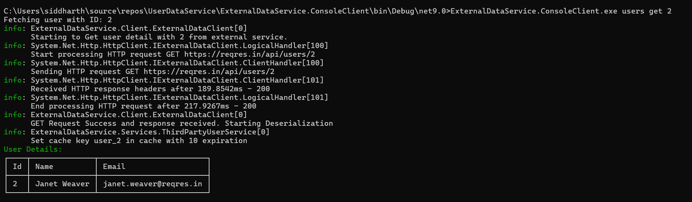
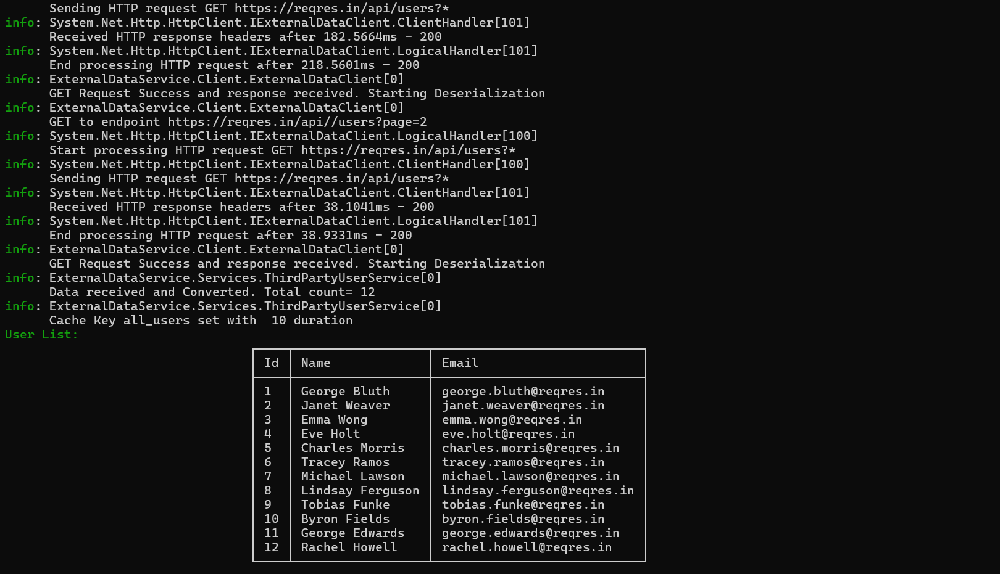

## ExternalDataService

### Overview


ExternalDataService is a Class Library designed to integrate with third-party user data APIs. It provides a clean abstraction for fetching, converting, and caching user data and is built with extensibility and reliability in mind.

### Build Instructions


1. Prerequisites
   - .NET 9 SDK installed
   - (Optional) Visual Studio 2022 or later

2. Restore Dependencies
   dotnet restore

3. Build the Solution
   dotnet build

### Test Instructions


1. Run All Tests
   dotnet test

### Key Design Decisions


- Dependency Injection: All services are registered using IServiceCollection extensions for easy integration and testing.

- HttpClient: Uses AddHttpClient for resilient HTTP calls, with Polly for retry and timeout policies.

- Error Handling: The ExternalDataClient handles HTTP errors, deserialization issues, and timeouts gracefully, logging errors and returning null or empty results as appropriate.

- Separation of Concerns: The solution separates DTOs, domain models, and service logic for maintainability.

- Testing: Unit tests mock external dependencies and cover both success and failure scenarios.

- Caching: Implements a simple in-memory cache for user data to reduce API calls and improve performance.

- Configuration: Uses a configuration settings to manage API endpoints and cache eviction policies, allowing for easy adjustments without code changes.


- ### Transient Error Handling

Transient errors (such as network timeouts, temporary unavailability, or HTTP 5xx errors) are handled using the Pollylibrary. The solution configures retry and timeout policies for all HTTP requests made by the `ExternalDataClient`:

- **Retry Policy:**  
  The HTTP client is configured to automatically retry failed requests according to the policy defined in `RetryConfiguration.cs`. This typically includes retries for transient HTTP errors (like 408, 5xx, and network failures).

- **Timeout Policy:**  
  A timeout policy is also applied to each HTTP request, ensuring that requests do not hang indefinitely. The default timeout is set to 10 seconds.

- **Configuration Location:**  
  These policies are registered in `ServiceCollectionExtensions.cs` using the `AddPolicyHandler` method when setting up the HTTP client.

- **Error Handling in Code:**  
  In addition to Polly policies, the `ExternalDataClient` class includes try-catch blocks to handle exceptions such as `TaskCanceledException` (for timeouts), `HttpRequestException` (for HTTP errors), and `JsonException` (for deserialization errors). Errors are logged to the console, and the methods return `null` or empty results as appropriate.

- **Do not Retry on 4xx Errors:**  
  The retry policy does not apply to 4xx errors (client errors) as these indicate issues with the request itself, such as invalid parameters or unauthorized access. The client will log these errors and return null or an empty result without retrying.
### Demo Command-Line Utility

A demo command-line utility (`ExternalDataService.ConsoleClient`) is included to test the library. This utility provides user management commands via the command line.

#### Command List

- **users get < id >**  
  Fetch a user by their ID.

 ```
 ExternalDataService.ConsoleClient.exe users get <id>
 ```

 Example:
 ```
 ExternalDataService.ConsoleClient.exe users get 2
  ```

  


  - **users list**  
  List all users.

Example
```
ExternalDataService.ConsoleClient.exe users list
```




### Contact


For questions or contributions, please open an issue or submit a pull request.

### License
MIT License